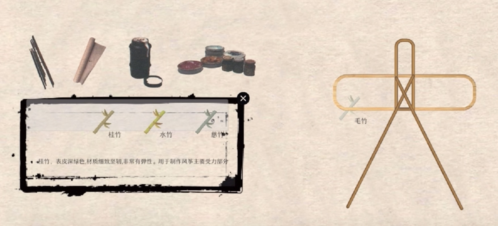
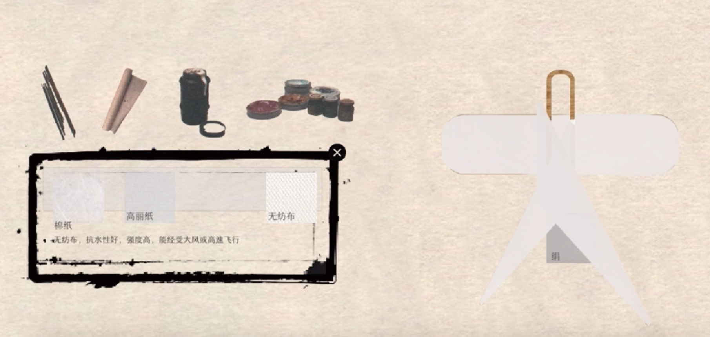
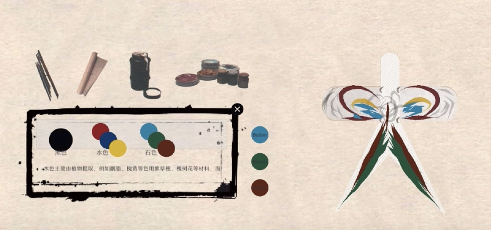

# Interactive-kite-game

## What:

The project was to let users experience the making of Chinese traditional kites. It involves selecting the skeleton, and the surface of the kites, and painting freely on the kites.Since balance is an important concept in kite making, weight calculation was also involved. 

The project was developed in Unity, and the codes here only contain the main parts, not the whole project.

## Function:

1. Drag and change the material
2. Draw feely
3. Calculate the weight 

## Result:

